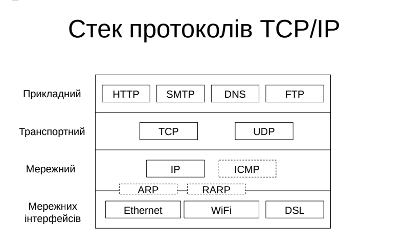

# Theory

For more info 
- [Site](https://www.cs.vu.nl/~ast/CN5/) 
- [Drive](https://drive.google.com/drive/folders/1L4MOviZmvxO1QYfLGzFK1kSWrqH2BEQs?usp=share_link)  

Протокол рівня n - правила та
домовленості, які використовуються для
взаємодії рівня n одного вузла з рівнем n
іншого вузла

Інтерфейс - правила взаємодії суміжних
рівнів в одному вузлі

Протокол - це горизонтальна взаємодія (між своїми протоколами передачі даних)
Інтерфейс - vertical communication (between protocols from different levels)

## ISO OSI

The ISO company (1983) made an Open System Interconnection Reference Model(OSI)

It is open specification.

Osi has 7 levels of communication and it doesn't describe protocols 

### Levels
#### Physical фізичний 
Біт  
Передача бітів по каналах
- Формування електричних сигналів
- Кодування інформації
- Синхронізація
- Модуляція
- Фізична топологія
- Фізичні характеристики інтерфейсів і носіїв
- Реалізується апаратно

Середовища передач
- Кабель
  - Вита пара
  - Коаксіальний кабель
  - Оптичний кабель
  - Мережа електроживлення
- Бездротові технології
  - Радіохвилі
  - Інфрачервоне випромінювання

Types
- Twisted pair
- coaxial
- optical

Модуляція (modulation) – процес зміни в часі за
заданим законом показників (характеристик) якогось з
регуляторних фізичних процесів. Накладання
низькочастотного інформаційного сигналу на
високочастотний сигнал-носій для передавання
даних на великі відстані.

Види модуляції:
- Аналогова.
- Цифрова.
- Імпульсна.

Є декілька видів коdувань

Типові топології - шина, зірка

**Пристрої**
Концентратор(хаб, повторювач) - длгічна топологія це спільна шина.

#### Data Link канальний 
Кадр  
Доставка кадру між 2 станціями
- Перевірка доступності середовища
- Групування даних в кадри
- Формування і перевірка контрольної суми
- Фізична адресація
- Управління потоком даних
- Реалізується програмно-апаратно

Заголовок - пакет - кінцевик

Методи виокремлення кадрів
- Вказівник кількості байт.
- Використання сигнальних байтів із символьним заповненням.
- Використання сигнальних бітів із бітовим заповненням.
- Використання заборонених сигналів фізичного рівня. (Наприклад кодування 4біт в 5 біт)

Помилки - затухання, спотворення, шум  
Виправлення - контрольна сума. Коди, що самовиправляються. Повторне надсилання даних.

Можлива колізія - спотворення даних, коли передають 2 присторої одночасно
Методи керування доступом:
- Випадковий.
- Детермінований:
  - Розподіл часу (проблема з ефективністю).
  - Передача повноважень. (передача маркера кожному пристрою. Проблема з втратою маркера)

Основні ідеї випадкового доступу
- Прослуховування несучої
- Перш ніж передавати дані необхідно перевірити чи вільне середовище.
- Чекати, поки інший вузол не закінчить передачу даних.
- Виявлення колізії
- Якщо двоє вузлів починають передавати одночасно, зупинитися.
- Коли два вузли передають одночасно – дані в каналі спотворені.
- Випадковість
- Не починати знову передавати дані відразу.
- Очікування випадкового часу перед повторною спробою.

**Пристрої**
Комутатор
- Пристрій канального рівня, зберігає та пересилає кадри даних.
- Перевіряє MAC-адресу вхідного кадру та вибірково пересилає кадр на один або кілька вихідних портів.
- Працює прозоро для вузлів.
- Plug-and-play, самонавчання, комутатори не потрібно налаштовувати.

#### Network мережний
Пакет  
Доставка пакета між будь-якими 2 вулами
- Логічна адресація
- Узгодження розмірів пакетів
- "Мережа" - сукупність комп'ютерів, що використовують для обміну даними єдину мережеву технологію
- Маршрут - послідовність маршрутизаторів, які проходить пакет
#### Transport транспортний
Сегмент (дейтаграма)  
- Передача даних між процесами на вузлах
- Надання потрібного рівня надійності передачі даних, незалежного від надійності мережі (гарантія доставки, гарантія порядку надходження повідомлення)
- Адресація (від 0 - 65535 кількість портів)

**Різниця між мережевим і транспортним**
- Мережний рівень – передача між вузлами
- Транспортний рівень – передача між процесами на вузлах

**Недоліки протоколу IP**

- Протокол IP забезпечує слабку модель обслуговування (найкраща спроба)
- Пакети можуть бути пошкоджені, затримані, відкинуті, переупорядковані, дубльовані
- Немає вказівок щодо того, скільки трафіку надсилати та коли

**Типи портів (ports)**
- 0-1023 - Добре відомі(controlled by IANA)a

> 80 - http
  22 -ssh

`netstat -an`

- 1024-49151 - Зареєстровані(користувацькі) порти
- 49152-65535 - Динамічні (приватні)

**Протоколи**
- TCP
- UDP


#### Session сеансовий 
Повідомлення 
- Встановлення способу обміну повідомленнями (дуплексний або напівдуплексний)
- Синхронізація обміну повідомленнями
- Організація "контрольних точок" діалогу
#### Presentation представлення
Повідомлення 
- Перетворення даних з зовнішнього формату у внутрішній і навпаки
- Шифрування і розшифрування даних
- Стиснення
#### Application прикладний
Повідомлення 
- Ідентифікація, перевірка прав доступу користувача
- Принт і файл-сервіс, електронна пошта, віддалений доступ ...


## TCP/IP
4 рівні
|OSI|TCP/IP|
|--|--|
|Application|Session|
|Presentation| 
|Session|
|Transport|Transport|
|Network|Network|
|Data link| Мережевих інтерфейсів|
|Physical|



### Network Level
IP protocol 
Передача без встановлення з'єднання
- Немає гарантії доставки
- Довільний порядок доставки
Завдання IP
- Маршрутизація
- Об'єднання мереж
- Якість обслуговування

|Заголовок|Дані|Кінцевик|
|--|--|
|6+6+2|46-1500|4|

#### Types of addresses
|Local|Global|
|--|--|
|Привязка до технології. Приклад MAC addresses|Не привязуватися до технології. Приклід IP-addresses|

#### IP-addresses IPv4
Example 10.0.0.0

- Class Model
  A - 16 777 216
  B - 65636
  C -  256
  D - group addresses
  E - Зарезервовано

-  Mask Model
  Example 10.0.0.0/8  
  Storage 32bits  
  /8 tells that first 8 bits is in use, so other 32-8=16 bits we can use. 2^16 Avaliable addresses
  Example of /8 Mask 11111111 00000000 00000000

Private addresses
- 10.0.0.0 - 10.255.255.255 / 8
- 172.16.0.0 - 172.31.255.255 / 12
- 192.168.0.0 - 192.168.255.255 / 16

Special addresses
- 0.0.0.0 даний вузол
- 255.255.255.255 всі вузли в мережі 
- 127.0.0.0 loopback

2^32 = 4bilion addresses

#### IP-addresses IPv6
Недоліки протоколу IPv4

- Маленький простір адрес.
- Контрольна сума заголовку.
- Фрагментація пакетів на проміжних вузлах.
- Проблеми маршрутизації.
- Використання технології трансляції адрес – NAT.
- Відсутність наскрізної реалізації якості обслуговування – QoS.
- Змінна структура заголовку через наявність поля Options.
- Відсутність вбудованої підтримки безпеки.

Проблеми впровадження IPv6

- IPv6 не сумісний з IPv4.
- Потрібна повна заміна, помітна для користувачів.
- Для багатьох проблем IPv4 вдалося знайти рішення (хоча б тимчасові).
- Нестача IPv4-адрес – NAT.
- Низька безпека – IPSec.
- Якість обслуговування – Диференційоване обслуговування.
- Користувачі та організації не розуміють, навіщо переходити на IPv6.

2^128 addresses
Діапазон адрес IPv6 складає від
0000:0000:0000:0000:0000:0000:0000:0000
до
ffff:ffff:ffff:ffff:ffff:ffff:ffff:ffff
Правила скорочення під час запису
- Прибираємо початкові нулі: 2001:DB8:0000:1811:0000:0000:47:318
- Прибираємо довгі послідовності нулів: 2001:DB8:0:1811::47:318

- Unicast адреси ідентифікують лише один мережний інтерфейс.
Протокол IPv6 доставляє пакети, надіслані на адресу, на
конкретний інтерфейс.
- Anycast адреси призначаються групі інтерфейсів, які зазвичай
належать різним вузлам. Пакет, надісланий на таку адресу,
доставляється на один з інтерфейсів цієї групи, як правило,
найбільш близький до відправника з точки зору протоколу
маршрутизації.
- Multicast адреса також використовується групою вузлів, але
пакет, надісланий на таку адресу, буде доставлений кожному
вузлу групи.
- Broadcast – немає.

Зарезервовані адреси в IPv6

- Global unicast – аналог глобально-маршрутизованої адреси
IPv4. Глобальні індивідуальні адреси можуть бути налаштовані
статично або динамічно. Починається з 2 або 3. Від 2000::/3
до 3FFF::/3. З цієї групи окремо виділяється мережа
2001:0DB8::/32 – зарезервована для прикладів в
документації.
- Link-local – адреси мережі, які призначені тільки для обміну
даними в межах одного сегмента мережі або магістрального
каналу без маршрутизації у сусідні сегменти. Є аналогом мережі
169.254.0.0/16 в IPv4. Локальні IPv6-адреси каналу
знаходяться у діапазоні FE80::/10.
- Host-local(Loopback) – адреса використовується вузлом для
відправки пакета самому собі і не може бути призначена
фізичному інтерфейсу. Є аналогом адреси 127.0.0.1 в IPv4.
Loopback-адреса IPv6 – ::1/128 або просто ::1.
- Unspecified address – невизначена адреса складається з нулів і
в стислому форматі представлена як ::/128 або просто ::
Адреса не може бути призначена інтерфейсу. Є аналогом
адреси 0.0.0.0 в IPv4. Невизначена адреса використовується
як адреса джерела, коли пристрою ще не призначена постійна
IPv6-адреса.
- Unique Local Unicast (Site-local) – IPv6-адреси мають деякі
спільні особливості з локальними адресами IPv4. Є аналогом
мереж 10.0.0.0/8, 172.16.0.0/16, 192.168.0.0/24 в IPv4.
Знаходяться у діапазоні від FC00::/7 до FDFF::/7.
- Multicast – для розсилок усередині групи. Є аналогом мереж
224.0.0.0/4. Знаходяться у діапазоні FF00::/8.

Варіанти призначення IPv6
адрес
- Вручну
- DHCPv6
- Автоматична конфігурація (ICMPv6 - отримує групову адресу)
- Формування Interface ID на основі MAC-адреси – процес EUI-64 (Extended Unique Identifier, 64 біта)
- Отримання від маршрутизатора Subnet ID та інших параметрів

#### Protocols
- IP передача   
- ICMP діагностика (used in `ping` `traceroute`)  
- ARP визначення локальних адрес з глобальних  
- DHCP автоматичне конф вузлів (ip, mask, default gateway, ip of DNS-server) 

**DHCP**  
DHCP DISCOVER - широкомовний запит поушку сервера  
DHCP OFFER - пропозиція IP адреси  
DHCP REQUEST - запит певної адреси  
DHCP ACK - підтвердження, що адреса призначена клієнтові  
DHCP RELEASE - звільнення адреси  

All this needed because it is usually more than 1 DHCP server in the network

Static time and *Leasee Time*
> If phone is disconected ip address would be released after a time

#### Маршрутизація

Маршрутизатор – пристрій, який пересилає пакети
між комп'ютерними

Багатокрокові (повністю формує шлях)

Однокорокові (шлях до наступного роутера)

Проста (рандомна) Статична(Next hop) Динамічна(protocols like OSPF or RIP)

RIP -  дистанційно векторний алгоритм. Найкращий шлях - накоротший шлях. Є обмеження по довжині шляху (здається він повинен бути менше 16 роутерів)
Використовує UDP порт 520
- Версія 1 використовує широкомовну розсилку
- Версія 2 використовує мультикаст

OSPF - алгоритм стану каналів. Враховує різні метрики. Менше трафіку ніж ріп. Алгоритм дейкстре.

### Application level
Інтерфейс до сервісів, для кінцевого користувача

#### Protocols  
HTTP, SMTP, DNS, FTP

#### Types of architecture

1. Client - server architecture
2. Однорангова (peer-to-peer) - виділяють ресурси і користуютьсяя ресурсами (torrent)

##### DNS
Domain Name System   
Перетворення адрес в символьну репрезентацію  
Розподілена система; Дилегування відповідальності  
**Ієрархія доменів**
"велика шістка": .edu, .com, .gov, .mil, .org, .net
"для країни": example "UA"

```marmid
            .

edu com gov ua org mil net
            |
           kpi
            |
            comsys
            |    \
            |     \
         cloud    bbb


example: bbb.comsys.kpi.ua
url: https://bbb.comsys.kpi.ua/
```
root - "."  
макс глибина "127"  
макс довжина вузла "63"  
макс імя "253"  

Домен - піддерево

Зони DNS - частина дерева імен DNS

Root-servers
[A-M].ROOT-SERVERS.NET

Ітеративний режим - клієнт ходить до більш точнішого сервера за ієрархією
Рекурсивний режим - dns сервер ходить замість клієнта і віддає готовий результат

Визначення зворотної адреси
ip 77.47.133.222  
222.133.74.77.in-addr.arpa

##### Електронна пошта SMTP
Client -smtp-> mail transfer agent -> storage -imap-> client

name@domail.name.ua

TCP:25 or :587 or :465

##### HTTP
base of World Wide Web

без збереження стану  
TCP:80

URL `<scheme>://<host>:<port>/<path>;<parameters>?<query>#<fragment>`
URN

1. GET
1. POST
1. HEAD
1. PUT
1. DELETE
1. TRACE
1. OPTIONS
1. CONNECT

---

1. 1XX - informative
1. 2XX - OK (200)
1. 3XX - reddirect (301 - permanent, 307 -  Temporary reddirect )
1. 4XX - error on client (403 - prohibited, 404 - not found)
1. 5XX- error on server (500 - internal error)

### Ethernet

Physical and Datalink layers

**IEEE802 standarts**

Versions
|name|speed|type of cabel|standart|
|--|--|--|--|
|Ethernet| 10mb/s|коаксіальний кабель, вита пара, оптика |802.3|
|Fast Ethernet| 100mb/s|вита пара, оптика|802.3u|
|Gigabit Ethernet|1gb/s|вита пара, оптика|802.3z 802.3ab|
|10G Ethernet| 10gb/s|вита пара, оптика|802.3ae, 802.3an|
|40, 100G Ethernet| 40 or 100 gb/s|твінаксіальний мідний кабель, оптика|802.3ba|
|200, 400G Ethernet|оптика|802.3bs|

**Формат кадру Ethernet**

|6|6|2|46-1500|4|
|-|-|-|-|-|
|Адреса отримувача|Адреса приймача|Тип|Дані|Контрольна сума|
|Заголовок|Заголовок|Заголовок||Кінцевик|


**MAC-адреса**

- Для ідентифікації мережних інтерфейсів вузлів мережі Ethernet
- Регламентовані стандартом IEEE 802
- Довжина 6 байт (48 біт)
- Форма запису – шість шістнадцяткових чисел:
- 18:c0:4d:b4:13:38
- 00:15:17:b8:0e:3c

Типи MAC-адрес

- Індивідуальний (unicast, 0 у першому біті старшого байту):
- 18:C0:4D:B4:13:38
- Груповий (multicast, перший біт старшого байту 1):
- 80-00-B4-12-C7-10
- Широкомовний (broadcast, всі біти 1):
- FF-FF-FF-FF-FF-FF

Розподіл MAC-адрес

- Структура MAC-адреси:
- Перші 3 байти – унікальний ідентифікатор організації (OUI), видаються IEEE виробникам обладнання
- Останні 3 байти – призначає виробник обладнання, який відповідає за унікальність
-
- Приклади OUI:
- 00:00:0C – Cisco
- 00:02:B3 – Intel
- 00:04:AC – IBM

Типи Ethernet

- Класичний Ethernet.
  - З'явився першим (1973).
  - Спільне середовище передачі даних, можливі колізії.
  - Метод доступу CSMA/CD.
  - Будується на основі концентраторів.
  - Недоліки: погана масштабованість, низька безпека.
- Комутований Ethernet.
  - Вдосконалена технологія (1995, Fast Ethernet, IEEE 802.3u).
  - Немає спільного середовища передачі даних.
  - Немає колізій.
  - Будується на основі комутаторів.

Сімейство протоколів IEEE 802.11

- Складається з серії напівдуплексних методів модуляції по повітрю, які використовують той самий базовий протокол.
- Однакова структура кадра.
- Використовує множинний доступ із визначенням несучої з уникненням колізій (CSMA/CA).
- Однакова топологія.

Типи топологій IEEE 802.11

- Топологія «точка-точка» (Ad-Hoc BSS): вузли взаємодіють безпосередньо один з одним.
- Централізована топологія з використанням базової станції (Infrastructure BSS): вузли обмінюються даними через точку доступу.

### WiFi
Проблема - A - B - C. Вузли A, C бачать B, але не бачать один одного.  
Carrier Sense is not effective

**Ключові моменти**

- Немає концепції глобальної колізії
- Різні приймачі чують різні сигнали.
- Різні відправники надсилають дані різним одержувачам.
- Колізії виникають у отримувача, а не у відправника
- Необхідно забезпечити лише те, щоб одержувач чітко чув відправника.
- Не має значення, чи чує відправник когось іншого.
- Поки цей сигнал не заважає приймачу.
- Мета протоколу
- Визначити, чи одержувач чує відправника.
- Сказати відправникам, які можуть заважати одержувачу, вимкнути передачу.

**Уникнення зіткнень**

- Оскільки ми не можемо виявити зіткнення, ми намагаємося їх уникати.
- Визначення несучої:
  - Якщо середовище зайняте, необхідно обрати випадковий інтервал.
  - Перед надсиланням зачекати обраний інтервал.
- Коли колізія трапилася, повторна передача з бінарною експоненціальною затримкою (як в Ethernet)
  - Використовувати ACK від одержувача, щоб зробити висновок «немає зіткнення»
  - Використовувати експоненціальне обернений таймер, щоб адаптувати вікно конкуренції

**CSMA/CA**

- Перед кожною передачею даних.
  - Відправник надсилає кадр запиту на надсилання (RTS), що містить довжину передачі.
  - Одержувач відповідає кадром Clear to Send (CTS).
  - Відправник надсилає дані.
  - Одержувач надсилає ACK; тепер інший відправник може надсилати дані.
- Коли відправник не отримує назад CTS, це означає колізію.

**Безпека в IEEE 802.11**

- WEP (Wired Equivalent Privacy) – найстаріший стандарт захисту
бездротового трафіку, заснований на алгоритмі потокового
шифрування RC4 (з використанням загального секретного
ключа).
- WPA (Wi-Fi Protected Access) – один з протоколів безпеки для
захисту бездротових мереж. Створений для заміни застарілого
протоколу WEP. Заснований на TKIP (Temporary Key Integrity
Protocol – протокол тимчасової цілісності ключів), який
ефективно бореться з проблемою, що лежить в основі
вразливості WEP – повторного використання ключів
шифрування.

### Socket
Socket - обмін між процесами
```marmid

      App                                App
       ^                                  ^
       |          TCP, UDP, SCTP          | Socket interface
Transport layer <----------------> Transport layer
```

## Фільтрація трафіку
Брандмауер(firefwall) - програма або апаратне забезпечення, розроблене для запобігання несанкціонованого доступу в/з приватної мережі"

Контроль сервісів
Контроль користувача
Контроль поведінки (DPI - продвинутий пристрій, що перевіряє вміст пакета)

**Типи**  
- Фільтр пакетів (мережний рівень, маршрутизатори) - кожен пакет порівнюється з певними правилами (protocol, ports, ip address)
> правила перевіряються знизу вгору, якщо 1 cпівпадіння - далі пакет не перевіряється

- Шлюзи сеансового рівня - відстежують сесії
- Шлюзи програмного рівня - прикладний рівень. Вміст вихідного повідомлення. На інцевих вузлах. найбільш ефективний.

# Labs

## DHCP
put server in same network, configure it, in the *computer* switch to *dhcp* from *static*
## RIP
```
enable
configure terminal
router rip
version 2
через інтерфейс пишеш адреси портів на роутері, який робиш
```
## OSPF
```
enable
configure terminal
router ospf 1
network *адрес порта* *маска порта, invered* area 0
коли ввів всі адреси то на роутері пишеш do wr

```
## IPv6
```
enable
conf t
ipv6 unicast-routing
ipv6 router rip cisco enable //замість cisco по ідеї можете писати все, що хочете, але має бути всюди одне й те саме слово

далі для кожного дроту, підключеного до роутера
int g0/0/0 //або просто тикаєте на потрібний інтерфейс у конфіг
ipv6 addres 2001:DB8:A::1/64 //буковка— підмережа (там можна до 4 символів, але можна не писати нулі, я підмережі з пк називав А, B, C, а між роутерами— AAAA, BBBB, CCCC, остання циферка (також до 4) це "номер" в підмережі як і в іпв4)
ipv6 rip cisco enable
no shutdown //вмикає вимкнутий порт
exit
```
## NAT
**Static:**
```
enable
conf term
ip nat inside source static [192.168.1.11 - local ip] [10.0.0.1 - public ip]
int [f/0/0]
ip nat inside
int [f1/0]
ip nat outside
exit 
exit
ip nat translations
ip nat statistics
```
**Dyncamic:**
if it was configured run `reload`
```
enable
conf term
ip nat pool [NAME] [start global ip - end global ip] netmask [mask] // netmask is optionally
access-list [1] permit [192.168.1.0 - start network ip] [inverse mask]
ip nat inside source list [1] pool [NAME]
int [fa0/0]
ip nat inside
int [fa0/1]
ip nat outside
```

**NAPT(PAT):**
```
enable
conf term
ip nat pool [NAME] [ip address usually which is on router (public)] [same ip address] netmask [mask]
access-list [1] permit [start local ip] [inverted mask]
ip nat inside source list [1] pool [NAME] overload
int [fa0/0]
ip nat inside
(maybe you need to run `exit` between this commands)
int [fa0/1]
ip nat outside
```
## WireShark
``` md 
> Traceroute sends upd so need to filter `udp or icmp`

traceroute <domain name>

> Tcp handshake
> filther in wireshark `tcp.stream`

nc www.youtube.com 80
GET /

> For http and https 
> filther `http or tls` as Https works with `ssl/tls`

curl http://www.youtube.com
```
