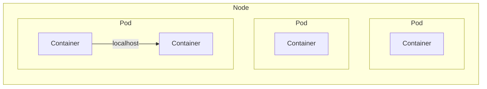
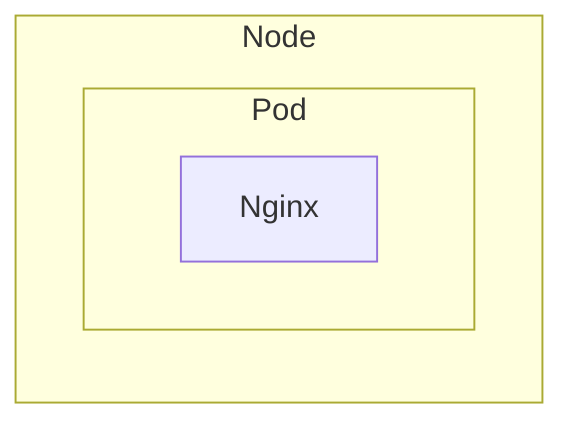
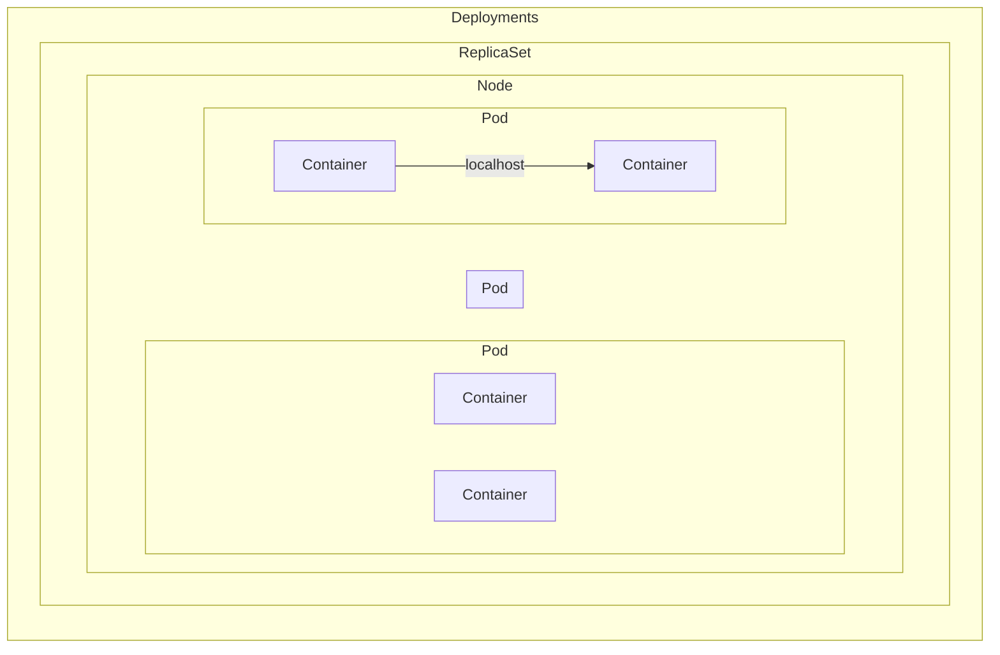
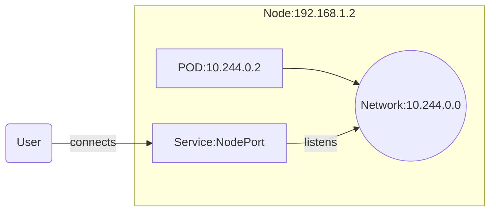
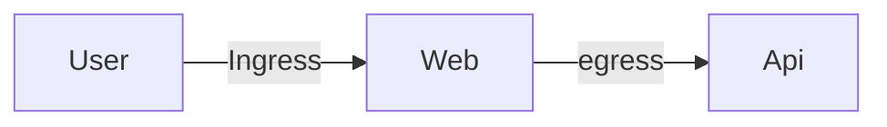
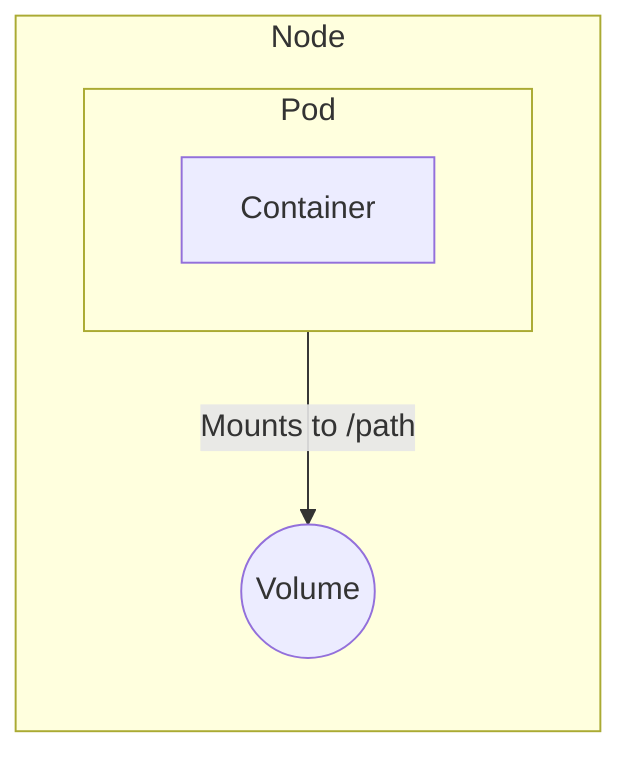

## Orchestration Technologies
- Docker Swarm (Docker), more easy
- Kubernetes (Google), difficult
- Mesos (Apache Mesos), difficult

## Kubernetes
### Pods
Pod is the smallest deployable unit in Kubernetes.

1. pending state - when the scheduler assigns the pod to a node
2. ContainerCreating - when the container is being created (after assigning the pod to a node)
3. Running 

Pod Conditions:
- PodScheduled
- Initialized
- ContainersReady
- Ready

To check if the pod is ready (not the contianer is running):
```yaml
kind: Pod
...
spec:
  containers:
  ...
  readinessProbe:
    httpGet:
      path: /health
      port: 8080
    initialDelaySeconds: 5 (op)
    periodSeconds: 5 (op)

    # or
    tcpSocket:
      port: 8080

    # or
    exec:
      command:
        - cat
        - /tmp/healthy
```

Liveness probe - checks if the container is alive
```yaml
kind: Pod
...
spec:
  containers:
  ...
  livenessProbe:
    httpGet:
      path: /health
      port: 8080
    initialDelaySeconds: 5 (op)
    periodSeconds: 5 (op)

    # or
    tcpSocket:
      port: 8080

    # or
    exec:
      command:
        - cat
        - /tmp/healthy
```

#### Logging in containers
```fish
k logs -f <pod-name>
k logs -f <pod-name> <container-name>
```

#### Designing
##### Lables, Selectors and Annotations
- Labels - key-value pairs that are attached to objects
- Selectors - used to select objects based on labels
- Annotations - key-value pairs that are attached to objects, but not used to identify and select objects, can be used to version the objects, etc.

```fish
kubectl get pods --show-labels
kubectl get pods -l app=myapp
kubectl get pods --selector app=myapp
```


### Node
Node is a worker machine, previously known as a minion. 
It may be a VM or physical machine, depending on the cluster. 
- kubelet

### Cluster
A cluster is a set of Nodes that run containerized applications.

### Master
Master is a machine that controls the cluster.
Master is responsible for managing the cluster nodes.
- kube-apiserver
- etcd
- kube-scheduler
- kube-controller-manager

### Components
- api-server - exposes the Kubernetes API
- etcd - (key-value store) a consistent and highly-available key value store used as Kubernetes' backing store for all cluster data.
- kube-scheduler - watches for newly created Pods with no assigned node, and selects a node for them to run on.
- kube-controller-manager - runs controller processes. Make desicions to bring up new pods.
- container runtime - software that is responsible for running containers. (Docker, rkt, containerd)
- kubelet - agent that runs on each node in the cluster. It makes sure that containers are running in a Pod.



Pod usually contains one container (1.1). But it can contain multiple containers.
Containers in a Pod share the same network namespace (localhost) & same storage and killed together

### namespace
Kubernetes creates the 
- `default` 
- `kube-system` (for kubernetes system services)
- `kube-public` (publicly accessible data)

Inside a namespace services refer to each other by their name (e.x. `db`), and outside by their name and namespace (e.x. `<name>.<namespace>.svc.cluster.local`, where `cluster.local` is a domain, `svc` is a subdomain (service))

The `kubectl get pods` lists pods in the current namespace (default is `default`)
```fish
kubectl get pods --all-namespaces
kubectl get pods --namespace=kube-system

kubectl create namespace dev
kubectl create -f namespace-definition.yaml

kubectl create -f pod-definition.yaml --namespace=dev


# set the default namespace
kubectl config set-context $(kubectl config current-context) --namespace=dev
```

```yaml
# pod-definition.yaml
apiVersion: v1
kind: Pod
metadata:
  name: myapp-pod
  namespace: dev
```

```yaml
# namespace-definition.yaml
apiVersion: v1
kind: Namespace
metadata:
  name: dev
```


```yaml
# quota-definition.yaml
apiVersion: v1
kind: ResourceQuota
metadata:
  name: compute-quota
  namespace: dev
spec:
  hard:
    pods: "10"
    requests.cpu: "4"
    requests.memory: 5Gi
    limits.cpu: "10"
    limits.memory: 10Gi
```

### CLI

```fish
# Create a pod
kubectl run nginx --image=nginx
kubectl run nginx --image=nginx --port=80 --expose # creates a service
# Generate a definition file based on the pod
kubectl get pod <name> -o yaml 

kubectl get all
kubctl get pods
kubctl get pods -o wide
kubctl describe pod nginx # more info
kubctl delete pod nginx
kubctl edit pod nginx


kubectl run <name> --image=nginx --dry-run=client # to test the command without executing it
-o yaml # to output the result in yaml format
```

```fish
kubectl run hello-minikube
kubectl cluster-info
kubectl get nodes

kubectl run redis --image=nginx --dry-run=client -o yaml
```

### Yaml
```fish
kubectl apply -f pod-definition.yaml
```
```yaml
apiVersion: v1
kind: Pod/Service/ReplicaSet/Deployment
metadata:
  name: my-app-pod
  labels: # key-value pairs (arbitrary)
    app: myapp
    type: front-end

spec:
  containers:
    - name: nginx-container
      image: nginx
      ports:
        - containerPort: 80 # exposed ports, so the pod listens to the current port
      envs:
        - name: some
          value: some-value
```

### Controllers
- replication set (replication controller, older), is used to make sure you have a specific number of pod instances running.


#### Replication Controller (deprecated)

```fish
kubectl create -f replicaset-definition.yaml
lubectl get replicationcontroller
```
```yaml
apiVersion: v1
kind: ReplicationController
metadata:
  name: myapp
  labels:
    type: replica

spec:
  replicas: 3
  template:
    metadata:
      name: myapp-pod
      labels:
        app: myapp
        type: front-end
    spec:
      containers:
        - name: nginx-container
          image: nginx
```

#### ReplicaSet

```fish
kubectl create -f replicaset-definition.yaml
kubectl replace -f replicaset-definition.yaml # to update
# or we can scale without updating the fiel `kubectl scale --replicas=6 -f replicaset-definition.yaml`, 
# or `kubectl scale --replicas=6 <type:replicaset> <name:myapp>`
# kubectl edit replicaset <replicaset-name>
kubectl get replicaset
kubectl delete replicaset <myapp> # deletes the replicaset and the pods
kubectl describe replicaset myapp
kubectl explain replicaset # replicaset can be shorten to `rs`
```

```yaml
apiVersion: apps/v1
kind: ReplicaSet
metadata:
  name: rp
  type: replica-set # not needed

spec:
  replicas: 3
  selector:
    matchLabels:
      type: replica-set-app
  template:
    metadata:
      labels:
        type: replica-set-app
    spec:
      containers:
        - name: nginx-container
          image: nginx
          ports:
          - containerPort: 80
```

### Deployments
- recreate
- rolling update (default)
- blue-green (not built-in) (new up, then reroute the traffic)
- canary (not built-in)


```fish
# record is used to record a command inside a `kubectl rollout history deployment.apps/my-app-deployment`
kubectl create deployment -f file.yeml --record
kubectl create deployment --image=nginx <name> --record
kubectl create deployment --image=nginx <name> --dry-run=client -o yaml
kubectl apply -f deployment-definition.yaml # to update the deployment
kubectl rollout status deployment.apps/my-app-deployment
kubectl rollout history deployment.apps/my-app-deployment
kubectl rollout undo deployment.apps/my-app-deployment --to-revision=1
kubectl rollout history deployment.apps/my-app-deployment --revision=2
```




```yaml
apiVersion: apps/v1
kind: Deployment
# ... same as replicaset
```

#### Rollout 
New deployment triggers a new rollout. Which create a new replicaset that is populated depending on strategy

- recreate strategy - all destroyed then all created
- rolling update (default) - 1 by 1

```fish
kubectl rollout status deployment.apps/appname-deployment
kubectl rollout undo deployment.apps/appname-deployment
kubectl rollout history deployment.apps/appname-deployment

# make a new version
kubectl apply -f deployment-definition.yml
```


### Networks

Each `pod` gets it's own address inside a networking-layour of the `node`, however 
ip migth clash with another `node's pods`, and Kubernetes doesn't create an automatic solution, thus 
we might use prebiuld solutions (e.x. from cisco). 
> We might configure it on our own, however `pod`s shouldn't use NAT, and have a unique addresses not to cause conficts


### Services


```fish
# The `selector` will automatically use the pod's labels
kubectl expose pod <pod-name> --type=NodePort --port=8080 --name=nginx-service --dry-run=client -o yaml

# Can't specify the targetPort, generate the file first
kubectl expose pod nginx --type=NodePort --port=80 --name=nginx-service --dry-run=client -o yaml


kubectl create service nodeport <name> --tcp=80:80 --node-port=30008
```

#### NodePort (acts like a router)
Connects outuer user to the `pod's` server
If it founds more than 1 `pod` with satisfied `selector` it will act
like a loadbalancer with strategy `random` & `sessionAffinity: true`
```yml
apiVersion: v1
kind: Service
metadata:
  name: myapp-service

spec:
  type: NodePort
  ports:
    - targetPort: 80 # (POD's port)
      # without a port it will be set to be the same as `targetPort`
      port: 80 # (service's port, which connects to the targetPort)
      # without a nodePort it will be picked random (for user to connect to the service)
      nodePort: 30008 # (range from 30000-32767)
  selector:
    app: myapps
```

```fish
kubectl create -f service-definition.yaml
kubectl get services
minikube service myapp-service --url # gets the url to which the service is accessible
```

#### ClusterIP (pod communication, default type)
Service that provides 1 interface to connet to the `node` cluster of pods, where he will choose `pods` randomly

```yml
apiVersion: v1
kind: Service
metadata:
  name: myapp-service

spec:
  type: ClusterIP
  ports:
    - targetPort: 80 # backend is exposed 
      port: 80 # services are exposed
  selector:
    app: myapps
```

```fish
kubectl create -f service-definition.yaml
kubectl get services
```

#### LoadBalancer
Not in the cloud plovider's context (e.x. virtualbox) will act like an `NodePort`

#### Ingress (not built-in)
Allows to expose the services to the outside world, with ssl and load balancing
- ingress controller (nginx, gcp, traefik, etc.)
- ingress resource (rules)

```yaml
apiVersion: extensions/v1beta1
kind: Deployment
metadata:
  name: nginx-ingress-controller
  namespace: ingress-nginx
spec:
  replicas: 1
  selector:
    matchLabels:
      app: nginx-ingress
  template:
    metadata:
      labels:
        app: nginx-ingress
    spec:
      containers:
        - name: nginx-ingress-controller
          image: quay.io/kubernetes-ingress-controller/nginx-ingress-controller:0.21.0
          args:
            - /nginx-ingress-controller
            - --configmap=$(POD_NAMESPACE)/nginx-configuration
            - --tcp-services-configmap=$(POD_NAMESPACE)/tcp-services
            - --udp-services-configmap=$(POD_NAMESPACE)/udp-services
            - --publish-service=$(POD_NAMESPACE)/ingress-nginx
            - --annotations-prefix=nginx.ingress.kubernetes.io
          env:
            - name: POD_NAME
              valueFrom:
                fieldRef:
                  fieldPath: metadata.name
            - name: POD_NAMESPACE
              valueFrom:
                fieldRef:
                  fieldPath: metadata.namespace
          ports:
            - name: http
              containerPort: 80
            - name: https
              containerPort: 443


# service

apiVersion: v1
kind: Service
metadata:
  name: ingress-nginx
  namespace: ingress-nginx
spec:
  type: NodePort
  ports:
    - name: http
      port: 80
      targetPort: 80
      nodePort: 30080
    - name: https
      port: 443
      targetPort: 443
      nodePort: 30443
  selector:
    app: nginx-ingress


# service account
for intellegent management

# ingress resource (rules)
# apiVersion: extensions/v1beta1
# kind: Ingress
# metadata:
#   name: myapp-ingress
#   namespace: dev
# spec:
#   backend:
#     serviceName: myapp-service
#     servicePort: 80

apiVersion: networking.k8s.io/v1
kind: Ingress
metadata:
  name: myapp-ingress
  namespace: dev
spec:
  rules:
    - host: myapp.com (if omit the host will be *)
      http:
        paths: 
          - path: /
            pathType: Prefix
            backend:
              service:
                name: myapp-service
                port:
                  number: 80
          - path: /api
            backend:
              service:
                name: myapp-api-service
                port:
                  number: 80
    - host: myapp2.com
      http:
        paths: 
          - path: /
            backend:
              service:
                name: myapp2-service
                port:
                  number: 80
```


### ConfigMaps

```fish
kubctl create configmap \
  <name-of-config> --from-literal=APP_COLOR=blue \
             --from-literal=...

kubectl create configmap \
    app-config --from-file=app_config.env

# from yaml file
kubectl create -f config-map.yaml
```


```yml
# config-map.yaml

apiVersion: v1
kind: ConfigMap
metadata:
  name: **app-config**
data:
  APP_COLOR: blue
  APP_MODE: prod

# pod.yaml
apiVersion: v1
kind: Pod
metadata:
  name: app
  labels:
    name: 
spec:
  containers:
  - name: name
  - image: imgae
  - ports:
    - containerPort: 8080
  envFrom:
    - configMapRef:
        name: **app-config**
```

### Secrets
Don't forget to encrypt the secrets.
Check docs (EncryptionConfiguration).
Also provide RBAC (role access control) to the secrets

```yaml
apiVersion: v1
kind: Secret
metadata:
  name: mysecret
data:
  DB_HOST: c2VjcmV0Cg== # Base64 echo -n 'some' | base64
  DB_USER: c2VjcmV0Cg==


##

envFrom:
  - secretRef:
      name: mysecret

```

### Security
```yaml
spec:
  containers:
    - name: name
      image: image
      securityContext:
        runAsUser: 1000
        capabilities:
          add: ["MAC_ADMIN"]
```

### ServiceAccount (old)
- user account for pods (for user to interact with cluster)
- service account for services (for machine to interact with cluster)

```yaml
spec:
  serviceAccountName: my-service-account
```

### Token requeet API


### Resources
```yaml
spec:
  resources:
    requests:
      memory: '1Gi'
      cpu: 1 # -> 1 vCPU as in host providers
    limits:
      memory: "2Gi"
      cpu: 2
```

Also there are `LimitRange` to limit the resources for the namespace (per a pod)
`ResourceQuota` to limit the resources for the namespace (all pods)


### Taints and Tolerations

`taint` - a property that restricts the pods that can be scheduled on a node
`toleration` - a property that allows a pod to be scheduled on a node with a taint

It is guaranteed that not other pods will be scheduled on the node, however pod might be scheduled on the node without the taint

```yaml
spec:
  toleration:
    .... check docs
```

### Node Selectors
```fish
kubectl label nodes <node-name> <label-key>=<label-value>
kubectl label nodes node-1 size=Large
```
```yaml
spec:
  nodeSelector:
    size: Large # labels
```

### Affinity (advanced node selectors)

It is guaranteed that the pod will be scheduled on the node with the affinity, however other pods might be scheduled on the node as well

```yaml
spec:
  affinity:
    nodeAffinity:
      requiredDuringSchedulingIgnoredDuringExecution:
        nodeSelectorTerms:
          - matchExpressions:
            - key: size
              operator: In
              values:
                - Large
                - Medium
```


### Multi-container Pods
Containers indside pods share the same network namespace, and can communicate with each other using `localhost`, and share the same storage

#### Init Containers
Containers that run before the main container starts (subsequently in ordre)
```yaml
spec:
  containers:
  ...
  initContainers:
    - name: init-1
      image: busybox
      command: ['sh', '-c', 'echo hello']
    - name: init-2
      image: busybox
      command: ['sh', '-c', 'echo world']
```


### Jobs
- Run to completion (pods by default are restarted if they fail `restartPolicy: Always`)
```yaml

apiVersion: batch/v1
kind: Job
metadata:
  name: my-job
spec:
  completions: 1
  parallelism: 1
  template:
    spec:
      containers:
        - name: my-job
          image: busybox
          command: ['sh', '-c', 'echo hello']
      restartPolicy: Never
```

#### CronJobs
```yaml
apiVersion: batch/v1beta1
kind: CronJob
metadata:
  name: my-cron-job
spec:
  schedule: "*/1 * * * *"
  jobTemplate:
    spec:
      completions: 1
      parallelism: 1
      template:
        spec:
          containers:
            - name: my-cron-job
              image: busybox
              command: ['sh', '-c', 'echo hello']
          restartPolicy: Never
```


### Network Policies



```yaml
apiVersion: networking.k8s.io/v1
kind: NetworkPolicy

psec:
  podSelector:
    matchLabels:
      role: db
  policyTypes:
  - Ingress
  - Egress
  ingress:
    - from:
      - podSelector:
          matchLabels:
            name: api
      ports:
      - protocol: TCP
        port: 80
  egress:
    - to:
      - podSelector:
          matchLabels:
            name: api
      ports:
      - protocol: TCP
        port: 80
```


### Storage

#### Volumes

```yaml
kind: Pod

spec:
  containers:
    - name: myapp
      image: nginx
      volumeMounts:
        - name: my-vol
          mountPath: /path
#  volumes:
#    - name: my-vol
#      emptyDir: {}

# volumes:
#   - name: my-vol
#     awsElasticBlockStore:
#     ...

  volumes:
    - name: my-vol
      hostPath:
        path: /data
        type: Directory

```

#### Persistent Volumes
##### Static provisioning - admin creates the volume
```yaml
apiVersion: v1
kind: PersistentVolume
metadata:
  name: my-pv
spec:
  accessModes:
    - ReadWriteOnce
  capacity:
    storage: 1Gi
  hostPath: # not to be used in production
    path: /data

# PersistentVolumeClaim

apiVersion: v1
kind: PersistentVolumeClaim
metadata:
  name: my-pvc
spec:
  accessModes:
    - ReadWriteOnce
  persistentVolumeReclaimPolicy: Retain
  resources:
    requests:
      storage: 500Mi

# Pod
apiVersion: v1
kind: Pod
metadata:
  name: mypod
spec:
  containers:
    - name: myfrontend
      image: nginx
      volumeMounts:
      - mountPath: "/var/www/html"
        name: mypd
  volumes:
    - name: mypd
      persistentVolumeClaim:
        claimName: myclaim
``` 

##### Dynamic provisioning
sc-definition.yaml - storage class type (`name: my-name`)
~pv-definition.yaml~ - persistent volume, created automatically by the storage class
pvc-definition.yaml - persistent volume claim (`storageClassName: my-name`)
pod-definition.yaml - pod (`persistentVolumeClaim: claimName: my-claim`)

### StatefulSets 
As `deployments` they can scale up, scale down, however they are deployed in order, and have a unique network identity
- useful for database replication
- no random names (e.x. `myapp-0`, `myapp-1`, etc.)

```yaml
apiVersion: apps/v1
kind: StatefulSet
...
spec:
  ...
  serviceName: my-service
```

##### Headless Service
Unlike `service` it doesn't have a cluster ip, and it doesn't load balance
It creates a DNS entries using the pod's name (e.x. `pod-name.my-headless-service.default-namespace.svc.cluster-domain.local`)

```yaml
# headless-service.yaml
apiVersion: v1
kind: Service
metadata:
  name: my-headless-service
spec:
  clusterIP: None
  selector:
    app: myapp
  ports:
    - port: 3306

# pod
apiVersion: v1
kind: Pod
metadata:
  name: myapp-0
  labels:
    app: myapp
spec:
  containers:
    - name: myapp
      image: nginx
  subdomain: my-headless-service (optional in `StatefulSet`)
  hostname: myapp-pod (optional in `StatefulSet`)

```


##### Volume Claim Templates
StatefulSet makes sure that the volume is created and attached to the pod, and after failure it is reattached to the new pod
```yaml
spec:
  ...
  volumeClaimTemplates:
    - metadata:
        name: my-pvc
      spec:
        accessModes:
          - ReadWriteOnce
        storageClassName: my-storage-class
        resources:
          requests:
            storage: 1Gi
```

### Security Primitives
Secure `host` - ssh keys without root access
Secure kubernetes api `kube-apiserver`
- who can access the api
  - static password file (deprecated)
    > ```csv
      passwrod, username, uid, optional-groups
    ```
    Then restart kub-apiserver.service with `--basic-auth-file=file.csv` flag
  - static token file
  - x509 client certificates
  - identity services
- what can they do (RBAC Authorization, etc.)

```fish
kubectl config view

kubectl get pods --kubeconfig configpath
$HOME/.kube/config (default)
--server my-kube-apiserver
--client-key my-key.pem
--client-certificate my-cert.pem
--certificate-authority my-ca.pem
```

- clusters
  > details about the cluster, deployments, provdiers
- contexts (which user can access which cluster, namespaces, admin@production)
- users
  > dev, admin
#### Api Groups
```fish
kubectl proxy # to start a proxy server with `config` file (so not to specify cert, etc.)

curl http://localhost:8001/apis
```

#### Authorization
- Node Authorization
- Attribute-based access control (ABAC)
- Role-based access control (RBAC)
- Webhook mode
- AlwaysDeny
- AlwaysAllow (default)

```yaml
# role-definition.yaml
apiVersion: rbac.authorization.k8s.io/v1
kind: Role
metadata:
  namespace: default
  name: pod-reader
rules:
  - apiGroups: [""]
    resources: ["pods"]
    verbs: ["get", "watch", "list"]

# role-binding-definition.yaml
apiVersion: rbac.authorization.k8s.io/v1
kind: RoleBinding
metadata:
  name: read-pods
  namespace: default
subjects:
  - kind: User
    name: dev-user
    apiGroup: rbac.authorization.k8s.io
roleRef:
  kind: Role
  name: pod-reader
  apiGroup: rbac.authorization.k8s.io
```
```fish
cat /etc/kubernetes/manifests/kube-apiserver.yaml

kubectl get roles
kubectl get rolebindings
kubectl describe role pod-reader
```

- namespaced
- cluster-wide (nodes, persistent volumes, namespaces, etc.) - for `cluster`s and all `namespace`s
> To watch `kubectl api-resources --namespaced=false`
  - cluster role (as role)
  - cluster role binding (as role binding)
```fish
kubcutl api-resources
```

##### Admission Controller
```mermaid

graph LR
  Request -->|Authenticated| API -->|Authorized| Admission Controller -->|Checked other permissions| API -->|Validated| API

```
```fish
kube-apiserver -h | grep enable-admission-plugins
kubectl exec kube-apiserver -n kube-system -- kube-apiserver -h | grep enable-admission-plugins # kubeadm setup

kubectl explain pod # to see in which API group the pod is
# KINK: POD
# VERSION <GROUP>:<VERSION>
kubectl api-resources

kubectl get pod -n kube-system
```

1. mutation admission controller
2. validation ac

### Deprecation
```fish
# a separate plugin (so needs to be installed separately)
kubectl convert -f pod-definition.yaml --output-version=v1
```

### Custom Resource Definitions (CRD)
```fish
```
