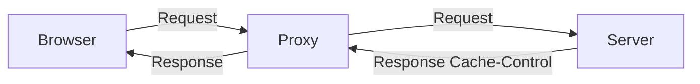
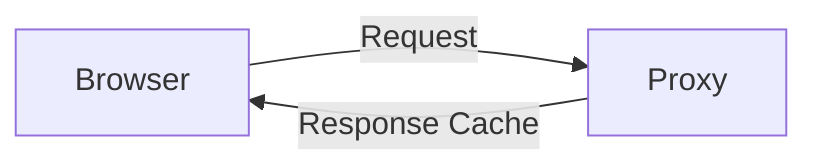
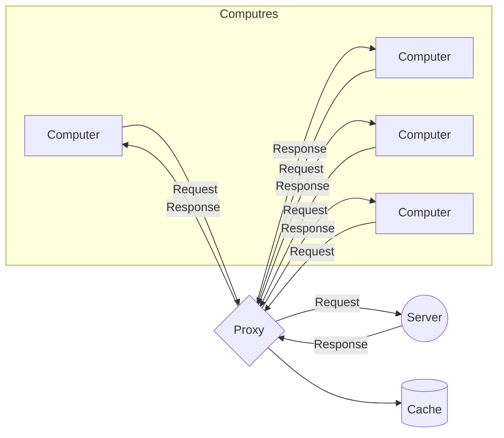
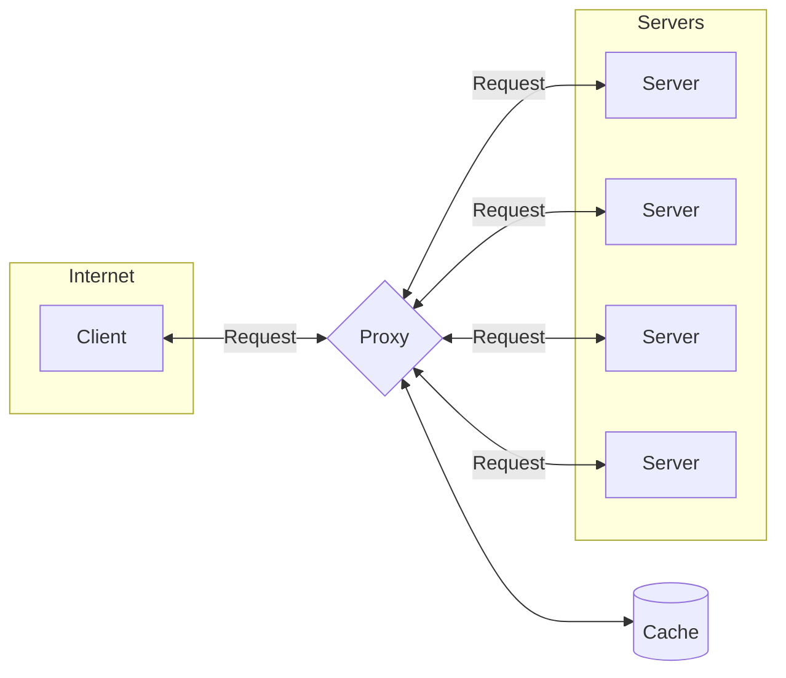

# NANT
### lab 1 (IP address)
Set up a static ip for virtual machine

**for boxes (doesn't work ;X))**  
systemctl enable --now virtnetworkd-ro.socket  
https://gitlab.gnome.org/GNOME/gnome-boxes/-/issues/546  
to undo  

systemctl disable --now virtnetworkd-ro.socket  
sudo nmcli connection delete br0  
sudo nmcli connection delete bridge-slave-eth0  

```fish
# x = 7
# IP(host) = 192.168.107.1/24
# IPvm2    = 192.168.107.20/24
# IPvm2(2) = 172.17.207.20/24

# check your interfaces
ip addr

### /etc/network/interfaces
# ...
# auto enp0s8
# iface enp0s8 inet static
# address 192.168.107.10/24
# mtu 1050
# up ip addr add 172.17.107.10/24 dev enp0s8 # additional ip
# post-up ip route add 172.17.207.0/24 via 192.168.107.1

# Had to configure windows firewall
ping -c 7 -s 2100 192.168.107.20

sudo arp
sudo arp -s ip mac
sudo arp -d ip

nslookup comsys.kpi.ua
traceroute -I 8.8.8.8
netstat -s 
# sudo tspdump -i enp0s3 (for global)
# sudo tspdump -i enp0s8 (for local) 
# ex. 
sudo tspdump -i enp0s8 
   "upd and src host 192.168.107.20 or (arp or icmp) 
         and dst host 192.168.107.20"
# to check ping vm2 or traceroute -I

```

### lab 2 (Dns)

Root servers (13)

1. Name  (domain name @domainName)
1. value (ip address)
1. type  (how to interpret the value)
1. class (the only class IN (internet))
1. ttl   (usually time to cache)


```marmid
          comsys.kpi.ua                 consys.kpi.ua          in1.ns.ua ip addr         consys.kpi.ua                ns.kpi.ua                  comsys.kpi.ua
 * Client ----------------> Local NS ----------------> Root NS ---------------> Local NS ----------------> UA zone NS ----------------> Local NS ----------------> kpi.ua NS ----------------> Local NS ----------------> comsys.kpi.ua
                          (Providers NS)             (Find UA zone)
                         (Other public NS)
```


#### Domain name
www.kpi.ua.

1. ua - top level domain (tld) (the highest level)
1. kpi - second level domain (sld)
1. www - computer name 


#### Types of dns 
Iterative - answer or thell when to go to another server
Recursive - ask another server to get the answer


- By default service proivder give you their dns server (to limit the outside traffic)

#### Types of answers
1. Authoritative - the server is responsible for the domain
1. Non-authoritative - the server is not responsible for the domain

#### Dns
- model server-client
- request-response
- udp (port 53) (client)
- tcp (port 53) (zone transfer)

#### Zones
- primary (master) - the server is responsible for the domain
- secondary (slave) - the server is not responsible for the domain


##### Flags
- qr (1 bit) - query or response (0 - query, 1 - response)
- opcode (4 bits) - type of query (0 - standard, 1 - inverse)
- aa (1 bit) - authoritative answer
- tc (1 bit) - truncated message (udp sometimes limits to 512 bytes)
- rd (1 bit) - recursion desired
- ra (1 bit) - recursion available
- z (3 bits) - reserved for future use
- rcode (4 bits) - response code (0 - no error, 1 - format error, 2 - server failure, 3 - name error, 4 - not implemented, 5 - refused)

#### Example of dns query
*Server*  
name: 6comsys3kpi2ua0
type: 1 (A)
class: 1 (IN)

*Answer*
name: 6comsys3kpi2ua0
type: 1 (A)
class: 1 (IN)
ttl: 3600 (seconds)
data length: 4 (bytes)
address: (4bytes ip address)

#### Commnads
- dig
- nslookup

#### Local DNS
- /etc/hosts


#### Lab 2
```fish
apt install bind9 bind9utils dnsutils

cd /etc/bind/
netstat -tulnp | grep 53

# named.conf.local (straightforward)
zone "example.org" {
  type master;
  file "/etc/bind/db.example.org";
};

cp db.local db.example.org

# @ is domain name (can be changed to implicit "example.org")
# IN is class (internet)
# SOA is start of authority, to define the zone
# ns1.example.org. is the name of the main (primary) server
# root.localhost is the email of the admin

# @ IN SOA ns1.example.org. admin.example.org. (
# 2006081401
# 28800
# 3600
# 604800
# 38400
# )

# Srial is the version of the zone file
# Refresh is the time to refresh the zone (how often secondary servers should check for updates)
# Retry is the time to retry the zone (how often secondary servers should retry to check for updates)
# Expire is the time after the primary server is not available, the zone is not valid
# Negative Cache TTL is the time to cache the negative response

#         Domain name (with dot fully qualified domain name (FQDN))
# @ IN NS ns1.example.org.
# @ IN NS ns2.example.org.
# Types of records

# ns1 IN A 10.12.34.34
# ns2 IN A 10.12.34.35
# host1 IN A 10.18.49.16
# host2 IN A 10.12.34.37

named-checkzone example.org /etc/bind/db.example.org # -> OK
systemctl restart bind9


# named.conf.local (backwards)
# WROTE IN REVERSE ORDER (10.18.49.*)
zone "49.18.10.in-addr.arpa" {
  type master;
  file "/etc/bind/db.49.18.10.org";
};

# db.49.18.10.org
# cp db.127 db.49.18.10.org

# named.conf.local ()

zone ... {
 ...
 allow transfer {
  <dns-addres-ip>;
 };
  notify yes; # to notify the secondary server
  also-notify { # to notify the secondary server after changes
    <dns-addres-ip>;
  };
};

### RESERVED SERVER
# apt update & apt install bind9 bind9utils dnsutils

# /etc/bind/named.conf.local
zone "example.org" {
  type slave;
  file "/var/cache/bind/db.example.org";
  masters {
    ip-addres-master;
  };
};

zone "49.18.10.in-addr.arpa" {
  type slave;
  file "/var/cache/bind/db.49.18.10.org";
  masters {
    ip-addres-master;
  };
};

systemctl restart bind9 (or rndc reload)

```

```fish
cat zones.rfc1918
cat named.conf.default-zones
# root zone

```


### lab 3 (Mail server)

Applied level

#### SMTP (Simple Mail Transfer Protocol)
Almost always `TCP` (port 25)
                    (port 587) (submission, for end client)
                    (port 465) (smtps)

Client Agent - implements the clinet interface
Mail Transfer Agent (MTA) - implements the server and the client interface

```marmaid

  Client
  Agent
    |
   SMTP
    |
    ~
  Transport ----- SMTP -------> MTA ---------> Database ------- IMAP, POP3 ----------> Client
  Agent
  (MTA - mail transfer agent)
    ^
    |
   MX
    |
    ~
   DNS
```

name@subdomain.domain.domain

##### How to find the server
DNS: MX (mail eXchnage)

#### Codes
- 220 - connection established
- 250 - successfull previous operation
- 354 - start transfer
- 502 - command not implemented
- 503 - bad sequence of commands
- 221 - closing connection

##### Headers
- From
- To
- CC
- BCC
- Reply-To
- Subject
- Date
- ...

#### Commands
`cat /etc/services | grep smtp # 25`  
```fish
dig -t mx comsys.kpi.ua
# or 
nslookup -type=mx comsys.kpi.ua

###
telnet mail.comsys.kpi.ua smtp
helo domain_name (or ip_address)
mail from: user@gmail.com
rcpt to: test@comsys.kpi.ua
data
Hello world!\
.
quit
```

- gmail
```fish
dig -t mx gmail.com
telnet ... 25
helo domain_name (gw.comsys.kpi.ua)
mail from: <your-email> (<test@gmail.com>)
rcpt to: <recipient-email>
data
from: <your-email>
subject: test
Hello world
.
quit
```

#### Security
Authentication in same domain is not required
Authentication in different domain is required

```fish
telent ... 25
ehlo test.comsys.kpi.ua # (extended hello)
auth login
334 VXNlcm5hbWU6 (base64) # echo VXNlcm5hbWU6 | base64 -d
# echo -n test | base64
...
...
mail from: test@comsys.kpi.ua
rcpt to: <recipient-email>
data
from: test@comsys.kpi.ua # not to go in spam
subject:
hello world
.
quit
```

```fish
openssl s_client -connect mail.comsys.kpi.ua:465 # or smtps

# or 
openssl s_client -connect mail.comsys.kpi.ua:25 -starttls smtp
```

#### DKIM (DomainKeys Identified Mail)
check if the mail is not modified
check key through DNS
```
DKIM-Signature ... s=selector`
```

```fish
dig -t txt <selector>._domainkey.<domain>
dig -t txt 1234._domainkey.gmail.com
```

#### SPF (Sender Policy Framework)
- RFC 7208
not all servers are allowed to send mail from the domain

##### Policies
- "+" - allow
- "-" - deny
- "~" - soft fail; which is not from the list, and might be sent to spam
```fish
# to start with we might just send the dns request
# dig -t txt gmail.com => redirect to _spf.google.com
dig -t txt _spf.google.com
```


#### DMARC (Domain-based Message Authentication, Reporting and Conformance)
DKIM + SPT =reports> DMARC

```fish
# dig -t txt _dmarc.gmail.com
```

#### Pop3
mainly TCP

used to download mail from the server

- port 110 - bacic
- port 995 - ssl/tls

Authentication is required

#### Commnds
```
telnet 10.18.49.180 110 # pop3
user test@comsys.kpi.ua
pass 1234
stat
list
top <id>
retr <id>
```

**openssl**
```fish
openssl s_client -connect mail.comsys.kpi.ua:995
# openssl s_client -connect mail.comsys.kpi.ua:110 -starttls pop3
```

#### IMAP4
Internet message access protocol

mostly TCP

- port 143
- port 993 (ssl/tls)

##### Catalogues (folders)
- INBOX

##### Flags
- \Seen
- \Answered
- \Flagged
- \Deleted
- \Draft
- \Recent

##### States
- Authentification
- Selected (folder)
- Logout

##### Responses
- OK
- NO
- BAD (syntax error)

#### Commands
```fish
telnet <ip> 143
a01 capability
a02 login <name> <password>
a03 list "" "*" # list all folders
a04 select INBOX # or inbox
# migth use `SEARCH ALL` to search for all messages (or search unseen)
a05 fetch 1:* flags # from 1 to end
a06 fetch 17 body[header]
a06 fetch 17 body[text]
```

#### Comparison
Pop3 - download and delete; simpler  
Imap - download and keep; more complex (folders, flags, states, sort)

### Infrastructure of open keys
- ssl (secure socket layer) (older)
- tls (transport layer security) (newer, mainly used)

- authentification - confirm the identity
- identification - recognize the object by the unique identifier
- authorization - after authentification, give the access to the resources

#### PKI (Public Key Infrastructure)

##### Certificates
1. Open/Close key
> Close key - private key, should be kept secret
2. Send **open key** to the **CA** (Certificate Authority)
> Identification (name, passport, etc.)
> Authentication
3. CA signs the **open key** with the **CA's close key**, and **CA's root certificate**
4. **Client** gets the certificated data

##### Center of the certificate
- generates the close key
> if CA is root, then it's self-signed
- generates certificats for the sub CAs
- keeps the list of the revoked certificates (register)
##### Registration authority
- checks the identity
- repository (list of the certificates)
- archive (list of the revoked certificates)

Usually the CA and the RA are the same (for small companies)

##### Formats
Signing - cyphering the hash of the message with the CA's close key
- X.509 (most popular)

###### Fields
- number of the certificate
- id of the algorithm
- name of the owner
- validity period
- public key of the subject
- name of the subject

###### Extensions
- доповнення
- обмежуючі доповнення
  - призначення ключа
- інформаційні доповнення
  - альтернативні імена

##### Structure of the certificate
RFC3280

- open key
- attributes
  - distinguished name
  - validity period
  - DN which signed the certificate
  - etc
- extensions
- CA's signature (cyphered hash of the certificate)

##### Terminal CA
All the names are in the openssl.cnf
```fish
mkdir ca
cd ca
mkdir certs crl newcerts private
chmod 700 private

# openssl gen<algorithm> <-aes256 to cypher the key> <4096 size of the key>
openssl genrsa -aes256 -out private/cakey.pem 4096

# <-x509 format> 
openssl req -new -x509 -extensions v3_ca -days 365 -key private/cakey.pem -out cacert.pem

# to check the certificate
openssl x509 -in cacert.pem -text

cp /etc/ssl/openssl.cnf .
vim openssl.cnf
# change the path to the ca directory (note there is not last slash)
# dir = /home/user/ca 
# default_bits = .... recommended for the CA to have lerger key size, however the larger the key, the slower the process; usually 2048 and ca 4096

touch index.txt
echo 1000 > serial
```

**Server**

```fish
mkdir server
cd server

# -nodes to not cypher the key, becuase if the server restarts, it will ask for the password, and for the automation it's not good
openssl req -new -nodes -newkey rsa:2048 -keyout serverkey.pem -out server.csr -days 365
# Common Name (CN) - the name of the server (dns name); checked by the CA (we can use mail.example.org free)
# server.csr is the request for the certificate
# serverkey.pem is the private key

# cypher the request
openssl ca -config ./file/openssl.cnf -out servercert.pem -infiles server.csr
# enter password for the CA's key
```
signing the message
```fish
echo "Hello world" > message.txt
openssl smime -sign -in message.txt -out signed.txt -signer servercert.pem -inkey serverkey.pem -text
openssl smime -verify -text -CAfile cacert.pem -in signed.txt

# certificate is in /usr/share/ca-certificates
# to work cp cacert.pem /usr/share/ca-certificates/mozilla/ot_ca.crt
# dpkg-reconfigure ca-certificates
# for this to work the servercert.pem should have digitalSignature, to enable it 
# we need to uncomment CA's openssl.cnf 
# keyUsage = digitalSignature, keyEncipherment

```

- connecting to a webserver
- with tls handshake we got the certificate
- the certificate is signed by the CA
- if we got the CA in our trusted list, we can trust the certificate
  > operating system, or the browser, or the application
- then we ask for the public key of the CA
- we uncypher the `signature value` with the public key of the CA
- we calculate hash of the fields of the certificate
- we compare the hash with the uncyphered `signature value`
- if they are the same, we trust the certificate
- then we can trust the public key of the server

#### Mail server configuration
##### Zones configuration (DNS)
```fish
vim /etc/bind/named.conf.local

zone "example.org" {
...
};

zone "zone01.com" {
...
}

vim /etc/bind/db.example.org
# change serial number
@ IN MX 10 mail.example.org. # 10 is a priority
...
mail IN A <IP OF THE VIRTUAL MACHINNE db.example.org is located on> # check with ip addr

# the same for zone01.com
# only change the domain name, dns, and the ip address for the mail
# e.x. cp db.example.org db.zone01.com && vim db.zone01.com

# in PTR add mail reverse ip addresses for the mail servers

# for slave server add zones as well

systemctl restart bind9 # on both machines
```

###### Resolving local domain names
```fish
/etc/resolv.conf
# domain example.org
# search example.org
# nameserver <ip of the dns server 1>
# nameserver <ip of the dns server 2>

sudo hostnamectl set-hostname <newhostname>
hostname # mail.example.org (server 1)
hostname # mail.zone01.com (server 2)
```
##### exim4
```fish
apt update && apt install exim4-daemon-heavy swaks
# ---------- #
sudo dpkg-reconfigure exim4-config
# first (internet site)
# mail.exampl.com 
# 0.0.0.0
# example.org
# ok (for all)
# ok, no, maildir format, yes

systemctl restart exim4
netstat -tulnp | grep 25
```

##### CA
Check the [CA](#terminal-ca) section
> The certificate is in `/etc/exim4/exim.crt` and the key is in `/etc/exim4/exim.key`

Then when you generate certificate get the signed server.csr with `Common Name` as `mail.example.org` and the `serverkey.pem` as the private key

```fish
# or use an example script 
# generate the certificate, exim or openssh
/usr/share/doc/exim4-base/examples/exim-gencert
# in servername mail.example.org
```

##### Tls
```fish
vim /etc/exim4/conf.d/main/03_exim4-config_tlsoptions
# define tlc (copy onto the start)
# MAIN_TLS_ENABLE = 1
```
Then add it to the trusted list
```fish
# CA's certificate is called cacert.pem
cp <CA certificate> /usr/share/ca-certificates/mozilla/my_ca.crt
dpkg-reconfigure ca-certificates # select my_ca.crt

# to the remote
scp /path/to/ca.crt user@target_machine:/path/to/destination
```

##### User & authentication
```fish
/usr/share/doc/exim4-base/examples/exim-adduser
# inside add to the and :<name>
# user1:...:1:user1

vim /etc/exim4/conf.d/auth/30_exim4-config_examples
# remove comments for plain_server, loign_server
```

##### Local mail delivery
```fish
vim /etc/exim4/conf.d/router/200_exim4-config_primary
# dns is not used in local addresses
# remove ROUTER_DNSLOOKUP_IGNORE_TARGET_HOSTS = < ... # remove local addresses
```

##### Virtual mail
```fish
# create file (350 is the number which indicates the order of the file, name is arbitrary)
vim /etc/exim4/conf.d/router/350_exim4-config_virtual_local
# virtual_local: 
#   driver = accept 
#   domains = +local_domains 
#   local_parts = lsearch;/etc/exim4/passwd 
#   transport = virtual_maildir

# where 
# local_parts is the file with the users 
# transport is an arbitrary name we chose to configure later


vim /etc/exim4/conf.d/transport/120_exim4-config_virtual_users
# virtual_maildir:  # our arbitrary name
#   driver = appendfile 
#   maildir_format 
#   create_directory = true 
#   directory_mode = 0700 
#   directory = "/var/vmail/${extract{3}{:}{$local_part_data}}" # <DELETE THIS COMMENT> {3} is the number of the field in the passwd file (in our case is name) (we specified it earlier in passwd user:password:user)
#   user = Debian-exim 
#   group = Debian-exim 
#   mode = 0660 
#   mode_fail_narrower = false 
#   return_path_add 
#   envelope_to_add 
#   delivery_date_add

# create the directory
mkdir /var/vmail
chown Debian-exim:Debian-exim /var/vmail
```

##### Ports
```fish
vim /etc/exim4/conf.d/main/01_exim4-config_listmacrosdefs

# add to the end
# tls_on_connect_ports = 465 
# daemon_smtp_ports = 25 : 465 : 587
```

##### Restart & check
```fish
sudo systemctl restart exim4
# check
netstat -tulnp | grep exim
# should see 25, 465, 587

swaks -a -tls -q AUTH -s mail.example.org -au user1


## SECOND SERVER ##
# same as the first server

# check after the configuration
swaks --from user@zone01.com --to user1@example.org --h-Subject "test" -s mail.zone01.com --auth-user vm2 -tls
# inside /var/vmail/alpha/new/ we should see the message
```

#### IMAP
```fish
apt install dovecot-imapd dovecot-pop3d
netstat -tulnp | grep dove

vim /etc/dovecot/conf.d/10-auth.conf
# change !include auth-passwdfile.conf.ext to be instead of another !include

vim /etc/dovecot/conf.d/10-mail.conf
# mail_location = maildir:/var/vmail/%u
# mail_uid = Debian-exim
# mail_gid = Debian-exim
# first_valid_uid = 150

vim /etc/dovecot/conf.d/10-ssl.conf
# ssl_cert = </etc/exim4/exim.crt>
# ssl_key = </etc/exim4/exim.key>

vim /etc/dovecot/conf.d/auth-passwdfile.conf.ext
# passdb {
# ...
# args = scheme=MD5-CRYPT ... /etc/exim4/passwd
# }
# userb {
# driver = static
# comment args =  ...
# }

systemctl restart dovecot

doveadm -v user user1
doveadm -v auth test user1
telnet 127.0.0.1 110
user user1
pass 1
list
retr 1

openssl s_client -connect mail.example.org:993 # imaps
a01 login user1 1
a02 logout

## Second server ##
the same

```

##### SPF
```fish
vim /etc/bind/db.example.org
# increment serial number
# add
@ IN TXT "v=spf1 mx -all"
# minus all the other records

vim /etc/bind/db.zone01.org
# the same as above

systemctl restart bind9

dig -t txt example.org

# without spf
swaks --from unexistinguser@zone01.com --to existinguser@zone01.com --h-Subject "test" -s mail.zone01.com # (from example org server)
# with spf
vim /etc/exim4/conf.d/main/01_exim4-config_listmacrosdefs
# add to the end
CHECK_RCPT_SPF = true
apt install spf-tools-perl
systemctl restart exim4

## SECOND SERVER ##
the same

# check spf with swaks above
```

##### DKIM
```fish
mkdir /etc/exim4/dkim
chown Debian-exim:Debian-exim /etc/exim4/dkim
cd dkim
openssl genrsa -out example.org.key 1024 # usually saved in DNS and larger keys might not be supported
openssl rsa -in example.org.key -pubout > example.org.pub
chown Debian-exim:Debian-exim example.org.key
chown Debian-exim:Debian-exim example.org.pub

vim /etc/exim4/conf.d/transport/30_exim4-config_remote_smtp
# DKIM_DOMAIN = ${lc:${domain:$h_from:}} 
# DKIM_KEY_FILE = /etc/exim4/dkim/<YOUR DKIM KEY LIKE: example.org.key>
# DKIM_PRIVATE_KEY = ${if exists{DKIM_KEY_FILE}{DKIM_KEY_FILE}{0}}
# DKIM_SELECTOR = dkim

systemctl restart exim4

cat /etc/exim4/dkim/example.org.pub # copy it 

vim /etc/bind/db.example.org
# serial number
# add (selector)
# dkim._domainkey IN TXT "v=DKIM1; k=rsa; p=<your key>"

vim /etc/exim4/conf.d/main/02_exim4-config_options
# add to the end
acl_smtp_dkim = acl_check_dkim

vim /etc/exim4/conf.d/acl/30_exim4-config_check_dkim
# paste the following
# acl_check_dkim: accept hosts = +relay_from_hosts 
# accept authenticated = * 
# # Message without sign 
# accept dkim_status = none 
# condition = ${if eq {$acl_c_dkim_hdr}{1} {no}{yes}} 
# set acl_c_dkim_hdr = 1 
# add_header = :at_start:X-DKIM: Exim 4 on $primary_hostname (no dkim signature) 
# # Message with sign, begin 
# warn condition = ${if eq {$acl_c_dkim_hdr}{1} {no}{yes}} 
# set acl_c_dkim_hdr = 1 
# add_header = :at_start:X-DKIM: Exim 4 on $primary_hostname 
# # Message with sign, bad signature 
# deny dkim_status = fail 
# message = Rejected: $dkim_verify_reason 
# logwrite = X-Auth: DKIM test failed: (address=$sender_address domain=$dkim_cur_signer), signature is bad. 
# # Message with sign, invalid signature 
# accept dkim_status = invalid 
# add_header = :at_start:Authentication-Results: $primary_hostname $dkim_cur_signer ($dkim_verify_status); $dkim_verify_reason 
# logwrite = X-Auth: DKIM test passed (address=$sender_address domain=$dkim_cur_signer), but signature is invalid. 
# # Message with sign, good signature 
# accept dkim_status = pass 
# add_header = :at_start:Authentication-Results: $primary_hostname; dkim=$dkim_verify_status header.i=@$dkim_cur_signer 
# logwrite = X-Auth: DKIM test passed (address=$sender_address domain=$dkim_cur_signer), good signature.
#
# accept

systemctl restart exim4


## SECOND SERVER ##
the same

swaks --from user1@exmple.org --to alpha@zone01.com --auth-user alpha --h-Subject "test" -tls -s mail.zone01.com
# /var/vmail/user1/new/... show have dkim signature
```

### FTP (File Transfer Protocol)
NAS architecture
TCP

- DAS - direct attached storage (local)
  > RAY - ray of disks; copy of the data between the disks. Has physical limitations
  > App -> file system -> disk
- NAS - network attached storage (access on file level)
  > NFS - network file system. We dependent on the filesystem of the server
  > App -> network -> file system -> disk
- SAN - storage area network (access on block level)
  > App -> file system -> network -> disk


```
FTP URL -> ftp://storage.domain.name/pub/file.txt

Client -> Server
^---------
```
Uses 2 or more connections (control and data)
Port 21 (control)
Port 20 (active data, server is an initiator)
Port > 1024 (passive data, client is an initiator)

#### Authentication
- Anonymous (name is ftp or anonymous)

#### Commandline
```fish
telnet <ip> 21 # control port
user ftp # anonymous
pass # any password for anonymous (even blank)
pwd
cwd /pub # change working directory
stat
type i # change to binary mode
pasv # passive mode  (ip,ip,ip,ip,port1,port2) port1 * 256 + port2
# attach a connection in # ---then---
list # list the files (wou)

port 192,168,1,1,10,1 # active mode #--active--
retr /pub/file.txt # retrieve the file

# ---then---
telnet <ip> <port1*256 + port2>

# ---active---
nc -l 2561 > file.txt
```

#### Safe FTP 
FTPS (FTP + TLS) (990 / TCP control; 989 / TCP data transfer)
SCP (Secure copy)
SFTP (FTP + ssh)

#### Terminal
```fish
apt install vsftpd
netstat -tulnp | grep 21
vim /etc/vsftpd.conf
###
anonymous_enable=YES
write_enable=YES
anon_upload_enable=YES
anon_mkdir_write_enable=YES
ftpd_banner=Welcome to FTP server
chroot_local_user=YES
chroot_list_enable=YES
user_sub_token=$USER
local_root=/home/$USER/ftp
chroot_list_file=/etc/vsftpd.chroot_list

anon_other_write_enable=YES

rsa_cert_file=<file>
rsa_private_key_file=<file>
ssl_enable=YES
force_local_data_ssl=NO # turn of the encryption for the data for testing


systemctl restart vsftpd
# inside /etc/passwd there is a new user
mkdir /srv/ftp/incoming
mkdir /srv/ftp/pub
chmod 777 /srv/ftp/incoming

adduser user1
adduser user2
mkdir /home/user1/ftp
chown nobody:nogroup /home/user1/ftp
vim /etc/vsftpd.chroot_list
####
user2

systemctl restart vsftpd


ftp <ip>
name: ftp
password: <blank>
ls
cd incoming
get file.txt

# 
openssl s_client -connect <ip>:21 -starttls ftp


# To make users to be able to write
vim /etc/vsftpd.conf
# add
write_enable=YES
# or user_config_dir=/etc/vsftpd/conf.d
# then for each user create a file with the name of the user and add write_enable=YES
```

### NFS (Network File System)
- NFSv2 (UDP)
- NFSv3 (TCP/udp)
- NFSv4 (TCP)
- No state (stateless)
- on core level (for speed)


- Physical Ethernet
- Link     Ethernet
- Network  IP
- Transport TCP/UDP
- Session  RPC
- Presentation XDR
- Application NFS (NFS protocol (not the file system))

`Inode #, inode generation #, file system id>`

## Virtual file system
If optical - ISOx96/64 filesystem
flesh - FAT
ssd - ext4
therefore VFS is implemented on the client
```
System call                   System call
vnode/VFS                     |
|       |           |         vnode/VFS
FAT32   EXT4 FS     NFS       |
|       |           |         server routines
USB     HDD         RPC       |
flash   ssd         |         RPC
>       >           > Network ^
```

## File path
More depth we have, more calls we need to make (time), therefore breadth first

- fd = open("/usr/joe/6360/list.txt")
- =>
- lookup (rootfh, "usr") => (fh0, attr)
- lookup (fh0, "joe") => (fh1, attr)
- lookup (fh1, "6360") => (fh2, attr)
- lookup (fh2, "list.txt") => (fh3, attr)

## Mounting
While mounted, local files become invisible, unless unmounted
`mountd` - can be run on different ports
rpcbind or portmapper - to map the ports (111 / TCP, UDP)

/etc/exports - main configuration file
/var/lib/nfs/xtab - list of the mounted directories
/var/lib/nfs/etab - list of the exported directories
/var/lib/nfs/rmtab - list of the remote mounts

/proc/fs/nfsd - nfsd configuration
/proc/net/rpc - rpc configuration
/var/run/portmap_mapping
 
> as a recap, NFS i a file level protocol, therefore only 1 read/write at a time
auth_nlm(no_auth_nlm) or secure_locsk(insecure_locks) - for the lock manager, auth for blocking the file

nohide (hide) - child directories should be exported explicitly
ro (rw) - ony read or read/write
secure(insecure)
subtree_check(no_subtree_check) - check the path, more secure, less performance
sync(async) - server might respond before the data is written to the disk
wdelay(nodelay) - delay the write
root_squash(no_root_squash) - root become UID/GID as you specify
all_squash(no_all_squash) - all users become UID/GID as you specify
anonuid, anongid - specify the UID/GID for the anonymous user
map_static - /etc/file_maps/users


nosuid - do not allow the suid
nodev - do not allow block devices
lock - allow to block NFS
mounhost - name
mountport - mountd dameon
port
rsize, wsize - size of the block
tcp/dup
fg/bg

```fish
# Server
# uname -a => core version
# check rg NFSD /boot/config<core-version>
# should have CONFIG_NFSD_V4=y

# no_subtree_check is also for a security reason; user might guess the file index

apt install nfs-kernel-server
netstat -tulnp 
rpcinfo -p
cat /proc/fs/nfsd/versions
mkdir -p /nfs/{ro,rw,test}
tree /nfs
vim /etc/exports
## IMPORTANT ##
## you need to use tabs instead of spaces
## you need to not have spaces after the comma
###
/nfs/ro <ip for allowed 10.18.49.0/24>(ro,sync,no_subtree_check)
/nfs/ro <ip for allowed 10.18.49.0/24>(ro,sync,no_subtree_check,anonuid=1000,anongid=1000)

systemctl restart nfs-kernel-server
cat /var/lib/nfs/etab # to check the exported directories

# Client
apt install nfs-common
mount <server ip>:/nfs/ro ro

umount /ro, /rw
```
```fish
vim /etc/default/nfs-kernel-server

/etc/resolv.conf
# domain zon07.com
# search zone07.com
# nameserver <ip>
```


## SMB & CIFS
Protocol for the file sharing for Windows
- SMB - Server Message Block
- CIFS - Common Internet File System

NAS architecture, so no need to download the file in order to work with it

- sessions
- file access level
- printing service
- message service

```
TCP/IP

Application SMB
Session     NetBIOS/NetBEUI
Transport   SPX/TCP/UDP/NetBEUI
Network     IPX/IP/NetBEUI
Link        LOM
Physical    LOM
```
NetBeui names are identificators
No more then 15 microsoft systems in 1 service is recoommend doue to broadcast (in particularly becase of SMB)

### Name Service
NetBios (NBNS or WINS - copy of DNS)
### Types of computers NetBios
- b-node - broadcast
> computers craetes packet for NetBIOS - UDP 3 (250ms) times 137 port -> if name is taken the computer sends secure packet -> if no response, the computer takes the name
- p-node - point-to-point
> computer sends the request to the NBNS, unicast (find through broadcast end then unicast) 137 port
- m-node - mixed (broadcast signin, broadcast for names); if no broadcast then NBNS for procedures
- h-node - hybrid (NBNS signin, point-to-point for names); if no NBNS then broadcast

### Session Service
NetBios (SMB)
Copy of TCP (139 port)

### Datagram Service
Broadcast 
Copy of UDP (138 port)

### Terminal
```fish
apt install samba
cp /usr/share/samba/smb.conf /etc/samba/
cd /etc/samba/
vim smb.conf
###
# we don't need printers
[homes]
  commnet = Home Directories
  browseable = no
  read only = no
  create mask = 0700 # 0664
  directory mask = 0700 # 0775
  valid users = %S
[hidden]
  path = /home/user1/hidden
  force user = root # owner of the created files in path
  force group = root
  browseable = no
  create mask = 0700
  directory mask = 0700
  # valid users = user1
  write list = user1
  guest ok = no # not to allow the guest
[pub]
  comment = Public readonly
  path = /home/pub
  browseable = yes
  writable = no
  guest ok = yes
[incoming]
  comment = Incoming writable access
  path = /home/incoming
  browseable = yes
  writable = yes
  guest ok = no
  create mask = 0666
  directory mask = 0777


systemctl restart smbd
systemctl restart nmbd

mkdir -p /home/pu{pub,hidden,incomming}
chmod -R 777 /home/ # we can use system privileges or the samba privileges (which is more flexible); though the privilages are combined from smb and system
cat /etc/passwd
smbpasswd -a user1 # must be in passwd


# Client
apt install smbclient
apt install nbtscan
nbtscan <ip>/24

nmblookup --d4 workgroup

smbclient -U guest -L <ip> # To list the shares
smbclient -U user1 //<ip>/homes
# smbclient -U user1 //<ip>/username
# ususal linux commnands
smbclient -U user1 -L //<ip>/hidden


nmblookup -M workgroup
nmblookup workgroup
```

## HTTP
- 80 / TCP
- udp might be used for video
- no state

- URL (Uniform Resource Locator)
  > <schema>://<host>:<port>/<path>;<parameters>?<query>#<fragment>
- URN (Uniform Resource Name) - doesn't depend from location in the net
- URI (Uniform Resource Identifier) - URL + URN

Http < 2.0 -> text
Http > 2.0 -> binary + text

### Structure
- Request
  > Method URI Vertion<CR><LF>
  > Headers
  > <CR><LF>
  > Body
- Response
  > Version Code Message<CR><LF>
  > Headers
  > <CR><LF>
  > Body

### Methods
- GET (we can send body with get to the server)
- POST
- PUT
...

### Codes
- 1xx - informational
- 2xx - success
- 3xx - redirection
- 4xx - client error
- 5xx - server error

### Terminal
```fish
telnet <ip> 80
GET / HTTP/1.0 # 1 request 1 response
<enter><enter>

GET / HTTP/1.1 # 1 request (connection is not closed immedietly)
host: <ip>

# URI is visible for everyone
GET get.php?name=Test Http/1.0 # it is limited to send data via URI

POST /post.php HTTP/1.1
host: <ip>
content-type: application/x-www-form-urlencoded
content-length: 9

# it can be encrypted
name=Test
<enter><enter>


# authrorization
GET /auth.php HTTP/1.1
Authorization: Basic <base64>
# echo -n "user1:password" | base64

nghttp -v http://<ip>
```

### Session
- headers
- ip addresses (nat -)
- large urls
- cookies
  - http request
  - http respoonse
  - files (cookies.txt)
  - internal storage (sessionStorage, localStorage)

### Permanent connection 
Http/1.0 - request response (after the response the connection is closed)
> keep in mind, that tcp starts from the 0 segment speed, and then increases  
> also it reserves memory depending on the speed, migth be 1mb for request, and 1mb for response
Http/1.1 - request several responses (the connection is not closed after response) (the drawback is that the server might be overloaded, even if the connection is not used)
It borkes the OSI model, becuas we tell tcp layer to close from the header of the http.
> Connection: keep-alive / close or timeout

### Caching
- http proxy server (browser -> http proxy server -> server -> http proxy server -> browser)
- browser cache (local cahce)

Header `Cache-Control: max-age=3600` - cache for 1 hour
- no-store
- no-cache
- public
- private 
- must-revalidate
- max-age=3600







- Expires - usually used to tell the browser not to cache the file
- Last-Modified - the last time the file was modified
- Get with condition
  - if-modified-since - based on metadata (answer, 304 not modified, expires, ast-modified, cache-control)
  - ETag (entity tag) - based on hash

### Proxy servers

- if outer proxies connectin is slower than the inner (Today, it is not the case)
- if we need to use 1 ip for the outer network (NAT suites better)
- if we need to cache the data (Sometimes it even might be slover with a large cache)
  
Today it is more common to use `reverse proxy` - where the proxy is located on the server side (for the load balancing, for the security, for the caching)


### Terminal
```fish
# 1
telnet <ip> 80
GET / HTTP/1.1
host: <ip>

# response
HTTP/1.1 200 OK
Date: <date>
...
ETag: "5c-hash"


# 2
telnet <ip> 80
GET / HTTP/1.1
host: <ip>
if-none-match: "5c-hash"

# response
HTTP/1.1 304 Not Modified


# 3
telnet <ip> 80
GET / HTTP/1.1
if-modified-since: <date>

# 4
...
#response
Expires: 19 Nov 1981 08:50:00 GMT
Cache-Control: no-store, no-cache, must-revalidate
```


```fish
sudo apt update && sudo apt install squid

telnet <ip> 3128
GET http://<ip> HTTP/1.1

vim /etc/squid/squid.conf
# localnet


# ssl
telnet <ip> 3129
CONNECT <ip>:443 HTTP/1.1

connectio: close # to close
```

## Load Balancing
### 1 computer 
- single point of failure
- no scalability

### Balancing
- http
- https (cypher on balancer, or on the server)
- tcp (assume that all connections are the same) 
- udp (dns)

### Algorithms
- round-robin - one by one, first request to the first server, second to the second, etc. (effective on large number of servers)
- least connections - to the server with the least connections (overcomes the round-robin efficiency on small number of servers)
- source hash - hash of the source ip address
- sticky sessions

### 2 LB
- active-passive - one is working, the other is waiting (heartbeat)
- active-active - both are working (heartbeat) (HA cluster - high availability)


### Terminal
```fish
# nginx
apt update && apt install nginx
netstat -tulnp | grep 80

vim /var/www/html/index.html
# <h1>Server 1</h1>

vim /etc/nginx/sites-available/default
# listne 127.0.0.1:80;
sudo systemctl restart nginx

# second server as well


vim /etc/nginx/conf.d/loadbalancer.conf # name arbitrary, suffix should be .conf
#
upstream backend_name {
  ip_hash; # algorithm
  server <ip1>:80;
  server 127.0.0.1;
}

server { # -> reverse proxy server
  listen <outer ip>:80;
  location / {
    proxy_pass http://backend_name;
  mabooledua@gmail.com}
}


tail -f /var/log/nbinx/access.log
tail -f /var/log/nbinx/errorr.log

# we can speify the server
telnet <outer ip> 80
GET / HTTP/1.1
host: <outer ip>
```


```fish
# install
# create /env/nginx/sites-available/http (to server on http static files from url)
#
server {
  listen 80;
  location / {
    root /var/www/html;
    auth_basic "Restricted Content";
    auth_basic_user_file /etc/nginx/tpasswd;
  }
}

# create ln -s /env/nginx/sites-available/http /env/nginx/sites-enabled/http

# check with `sudo nginx -t`

# create a .htpasswd file with apache2-utils
# htpasswd -c /etc/nginx/.htpasswd user1

# telnet <ip> 80
# GET / HTTP/1.1
# Host: <ip>
#
#

# ssl
# openssl s_client -connect <ip>:443
# GET / HTTP/1.1
# Host: <ip>
#
#

# e.x
# openssl s_client -connect www.metal.com:8888
# GET / HTTP/1.1
# Host: www.metal.com
# Authorization: Basic <base64>
# Connection: close

# to convert `echo -n 'gold:a' | base64`

# echo -e "GET / HTTP/1.1\nHost: www.metal.com\nAuthorization: Basic Z29s"
# openssl s_client -connect www.metal.com:8888
```


## Instant Messaging

### Desentralized
- XMPP (Jabber)
- Matrix

### Components
- identification
  > in `xmpp` it is `jid` (user@domain/resource)
- client state
- transport servcie


