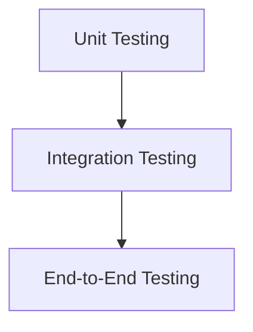

# Types of Testing

## Unit Testing
Tests a class or multiple classes __without external__ dependencies.
- cheap
- fast
- isolated (without dependencies)

## Integration Testing
Tests a class or multiple classes __with external__ dependencies.
- more expensive
- longer
- with external dependencies

## End-to-End Testing
Drives an application through its UI.
- very slow
- very expensive
- very brittle (breaks easily)

# TDD
Test Driven Development
- Testable source code
- Full coverage
- Simpler implementation

# Unit Tests
Think about tests like a black box.  
However, usually, you need to test all the branches of the code.

Trustworthy tests - if they fail, there is a bug in the code, if not, the code is correct.

Uncle Bob, Robert C. Martin - "Clean Code"
Unit testing double entry bookkeeping - for every debit, there is a credit.

## Good Unit Tests
- First class citizens (as important as the source code)
- Clean, readable, maintainable
- No logic 
- Isolated
- Not too specific/general

## What to Test?
### Query methods
Return a value  
Test the **outcome** of the method
### Command methods
Make changes to the system  
Test the **state** of the system after the method

### Never Test
- Language features
- 3rd party code

## Fundamentals
1. Extract the code which uses external dependencies into a separate class
2. Use interfaces to decouple the code
3. Use dependency injection to inject the dependencies
   - Method parameter injection
   - Property injection
   - Constructor injection

- State-based testing
- Interaction-based testing - usually only with external dependencies, because 
it couples the test to the implementation
